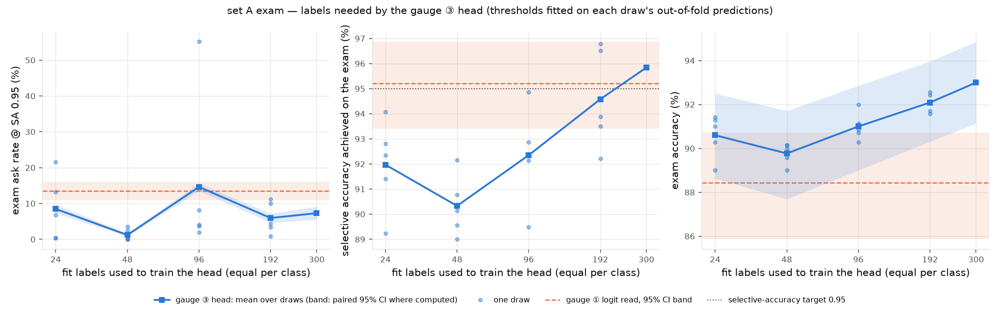

# nikasha

One sealed exam, many decision gauges. A gauge is any program that, for one item, returns a probability vector over the fixed label list (`no-call`, `one-call`, `multi-call`): one entry per label, every entry between zero and one inclusive, and the entries summing to one within a tolerance of one part in a million. Each gauge is its own process and writes `results/<gauge>.json`; the harness (`calibrate.py`, `score.py`, `readme.py`) reads that JSON and never imports an engine.

## Install

```
git clone https://github.com/anjansastry-hash/nikasha.git && cd nikasha
python -m venv .venv && source .venv/bin/activate
pip install -r requirements.txt
```

Use a full clone, not a shallow clone or a ZIP: selftest checks f and i read the git history. `make selftest` needs no model download; `make gauge1` needs the 12B weights at `$NIKASHA_ENGINE` or `~/mlx-models/gemma-4-12b-8bit-text`.

## Set A

set A: built from `gorilla-llm/Berkeley-Function-Calling-Leaderboard` (license Apache-2.0) at dataset revision `61fc0608cfd831fcfbbaa676ebdfef0ed963eeda`. Three labels, in fixed order:

- `no-call` — irrelevance files have no possible_answer ground truth; every item is labelled by category
- `one-call` — len(possible_answer ground_truth) == 1 (joined on id); items with count != 1 are dropped
- `multi-call` — len(possible_answer ground_truth) >= 2 (joined on id); items with count < 2 are dropped

| | total | no-call | one-call | multi-call |
|---|---|---|---|---|
| set A | 1000 | 334 | 333 | 333 |
| fit | 300 | 100 | 100 | 100 |
| exam | 700 | 234 | 233 | 233 |

Dropped for a category contradiction: 0 items — ground-truth call count contradicts the file's category.  
Dropped for missing ground truth: 1 item (BFCL_v3_live_multiple.json: 1) — no possible_answer row for the item's id (or ground_truth not a list/dict).  
Sampling draws at least 10 items from every non-empty source file, so live and non-live items both appear. Seed 20261007 for sampling and split.

Canary (KU3): verbatim completions 0/20, twins 0/20 — not flagged; gauge ① is reported as a zero-shot read.

## Results

| gauge | n_exam | accuracy [CI] | ECE raw → cal | ask rate @ SA 0.95 [CI] | selective accuracy achieved [CI] | AUROC [CI] |
|---|---|---|---|---|---|---|
| uniform | 700 | 33.4 [30.1, 37.3] † | 0.001 † → 0.001 † | 100.0 [100.0, 100.0] † | — | 0.500 [0.500, 0.500] † |
| majority-of-fit | 700 | 33.4 [30.1, 37.3] † | 0.666 → 0.666 | 100.0 [100.0, 100.0] † | — | 0.500 [0.500, 0.500] † |
| gauge ① logit read | 700 | 88.4 [85.9, 90.7] † | 0.106 † → 0.041 † | 13.4 [11.0, 16.0] | 95.2 [93.4, 96.9] † | 0.836 [0.789, 0.881] † |
| gauge ③ probe | 700 | 93.0 [91.1, 94.9] | 0.039 † → 0.030 † | 7.3 [5.4, 9.2] | 95.8 [94.3, 97.2] † | 0.904 [0.866, 0.936] † |
| Jev (external, hosted, same 300 items) | 300 | 86.0 [81.7, 90.0] † | 0.072 † → 0.072 † | n/a (no fit-split outputs) | n/a (no fit-split outputs) | 0.839 [0.768, 0.899] † |
| gauge J JSON emission ‡ | 700 | 87.7 [85.1, 90.1] | — | 2.7 [1.6, 3.9] (target not reachable) | 89.9 [87.6, 92.1] | — |

† within noise: 95% CIs overlap with another row.

A constant uniform predictor is calibrated by construction (confidence 1/3, accuracy ≈ 1/3), so its ECE overlaps any well-calibrated gauge.

95% percentile bootstrap CIs, 1000 resamples, seed 20261007; ECE with 15 equal-width bins; selective-accuracy target 0.95; thresholds fitted on the fit split only.

‡ Gauge J (pre-registered in PREREG.md, `## Amendment 2 — gauge J (JSON emission)`): accuracy is J-trust (the emitted decision taken as given, a parse failure counted as wrong); ask rate and selective accuracy are J-gated (per-class thresholds on the emitted confidence, a parse failure counted as an ask). Its CIs use 2000 resamples paired with gauge ①, so it is left out of the † marks; parse failures, the paired difference and latency are in the Gauge J section.

Letter bias of gauge ① logit read (fit split, rotation r0 minus the mean over rotations, logits per label in label order): [+0.36, +0.79, −1.63]; averaging over three letter orders removes this bias.


Hidden-state check (KU2): last hidden state shape [1, 156, 3840], head reproduces logits within max-abs 0.0 — PASS.

## Like-for-like: the same 300 exam items

Gauges ① and ③ (their fit-split T and thresholds) and Jev on the same 300 exam items (the Jev subsample, 0 Jev failures removed), one bootstrap order, so the rows' resamples are paired. The last two columns are the unfitted gate "answer iff max p ≥ 0.95" on each gauge's own final probabilities — no threshold fitted, reported for this group only.

| gauge | n | accuracy [CI] | ECE raw → cal | ask rate @ SA 0.95 [CI] | selective accuracy achieved [CI] | AUROC [CI] | unfitted gate: ask rate [CI] | unfitted gate: selective accuracy [CI] |
|---|---|---|---|---|---|---|---|---|
| gauge ① logit read | 300 | 88.3 [84.7, 91.7] † | 0.113 † → 0.061 † | 13.3 [9.3, 17.0] † | 95.8 [93.2, 98.0] † | 0.827 [0.746, 0.893] † | 62.7 [57.0, 67.3] | 98.2 [95.5, 100.0] † |
| gauge ③ probe | 300 | 93.7 [90.7, 96.0] † | 0.041 † → 0.032 † | 8.0 [5.0, 11.3] † | 96.7 [94.6, 98.6] † | 0.889 [0.815, 0.954] † | 29.7 [24.3, 35.0] † | 98.6 [96.7, 100.0] † |
| Jev (external, hosted, same 300 items) | 300 | 86.0 [81.7, 90.0] † | 0.072 † → 0.072 † | n/a (no fit-split outputs) | n/a (no fit-split outputs) | 0.839 [0.768, 0.899] † | 38.0 [32.7, 43.7] † | 96.8 [94.1, 99.0] † |

† within noise: 95% CIs overlap with another row.

Jev: 300 of 300 subsample items answered, 0 failed (listed in `results/jev.json`); 304 calls including 4 retries (cap 400); every response carried per-option probabilities, taken as its probability vector. Nothing is fitted for an exam-only subsample: T = 1 and no thresholds, so its ask rate at fitted thresholds is n/a. Raw responses: `results/jev-raw/`.

## Labels needed (gauge ③ head)

The gauge ③ head retrained on n fit labels (equal per class), 21 variants in all; each variant's T and per-class thresholds are fitted on its own out-of-fold fit predictions, then the 700-item exam is scored once per variant. Mean over draws (min–max) and the paired 95% bootstrap CI of the draw mean (1000 exam resamples, seed 20261007; the CI does not include draw-to-draw variation, the min–max does).

| fit labels n | draws | exam accuracy | ask rate @ SA 0.95 | selective accuracy achieved | draws meeting the SA target | within noise of gauge ① or better |
|---|---|---|---|---|---|---|
| 24 | 5 | 90.6 (89.0–91.4) [88.6, 92.5] | 8.5 (0.3–21.6) [7.2, 9.7] | 92.0 (89.2–94.1) | 0/5 | yes |
| 48 | 5 | 89.8 (89.0–90.1) [87.7, 91.7] | 1.2 (0.0–3.6) [0.8, 1.6] | 90.3 (89.0–92.2) | 0/5 | yes |
| 96 | 5 | 91.0 (90.3–92.0) [89.0, 92.9] | 14.6 (1.9–55.1) [13.5, 15.7] | 92.3 (89.5–94.9) | 0/5 | yes |
| 192 | 5 | 92.1 (91.6–92.6) [90.3, 94.0] | 5.9 (0.9–11.1) [4.7, 7.2] | 94.6 (92.2–96.8) | 2/5 | yes |
| 300 | 1 | 93.0 [91.1, 94.9] | 7.3 [5.4, 9.2] | 95.8 | 1/1 | yes |

Smallest n whose mean ask rate is within noise of gauge ①'s or better (pre-registered rule; gauge ① 13.4 [11.0, 16.0]): **24**. Read it with the selective-accuracy column: at n = 24, 48, 96, 192 the draw-mean selective accuracy achieved on the exam is below the 0.95 target (gauge ①: 95.2 [93.4, 96.9]), so thresholds fitted on that few out-of-fold predictions under-ask — a lower ask rate there is not an improvement at equal selective accuracy.



## Share of the gap

The analogue of the per-category threshold rung, on the 700-item exam with the ask rate at the selective-accuracy target as the metric: gauge ① at its fit-chosen global τ 0.84 asks 19.7 [17.0, 22.6], at its fit-chosen per-class τ 13.4 [11.0, 16.0]; gauge ③ at its per-class τ asks 7.3 [5.4, 9.2]. Per-class thresholds on the zero-shot read close a share **0.506 [0.386, 0.632]** of the gap between gauge ① at its global τ and gauge ③ (numerator 6.3 [4.6, 8.3], denominator 12.4 [9.7, 15.3] points; 95% paired bootstrap CIs, 1000 resamples).

## Gauge J — JSON emission

The common practice: ask the model to emit a JSON field and trust it. Gauge J asks the engine of gauge ① — the same tool list and request, without the lettered options — to reply with only `{"decision": "none" | "one" | "several", "confidence": …}`; greedy decoding, at most 48 new tokens, one generation per item, no retries, parsed from the first JSON object. Pre-registered in PREREG.md (`## Amendment 2 — gauge J (JSON emission)`) before gauge J read any set-A item; the exam was read once.

| gauge J row | n | accuracy [CI] | ask rate @ SA 0.95 [CI] | selective accuracy achieved [CI] | parse failures [CI] |
|---|---|---|---|---|---|
| J-trust: take the field, never ask | 700 | 87.7 [85.1, 90.1] | never asks | — | 0.0 [0.0, 0.0] |
| J-gated: per-class τ on the emitted confidence | 700 | — | 2.7 [1.6, 3.9] (target not reachable) | 89.9 [87.6, 92.1] | 0.0 [0.0, 0.0] |

Thresholds τ (none, one, several) = [0.91, 0.91, 0.91], fitted on the 300 fit items with gauge ①'s procedure (target not reachable on the fit split: the τ with the best fit selective accuracy, all classes); on the fit split J-gated asks 3.3 at selective accuracy 91.7. Parse failures on the exam: 0 of 700 (0 cut off at the token cap). Of the parsed replies, 681 report confidence exactly one.

Paired with gauge ① on the same resamples: ask rate J-gated − gauge ① (per-class τ, 13.4) = **-10.7 [-13.1, -8.3]** points — J-gated asks less than gauge ①, outside noise. Read it with the selective-accuracy column: J-gated does not reach the 0.95 target, so a lower ask rate than gauge ① is not a gain at equal selective accuracy.

Latency per decision on the same 50 fit items, one session: gauge J median 0.684 s, p90 0.845 s; gauge ① (three-rotation read) median 0.628 s, p90 1.148 s.

95% percentile bootstrap CIs, 2000 resamples, seed 20261007, over the 700 exam items in file order; thresholds fitted on the fit split only.

## Engines and licenses

- gemma-4-12b-8bit-text: license: apache-2.0 — license_link: https://ai.google.dev/gemma/docs/gemma_4_license
- jev-1.13: license: proprietary — no published weights ("Jev is a proprietary model and as such there are no published weights and no paper.")

## Promised, not claimed

promised, not claimed: embeddings gauge, set B, set C from the measured week

Generated by nikasha/readme.py from results/*.json and data/seta/manifest.json — no number in this file is written by hand.
