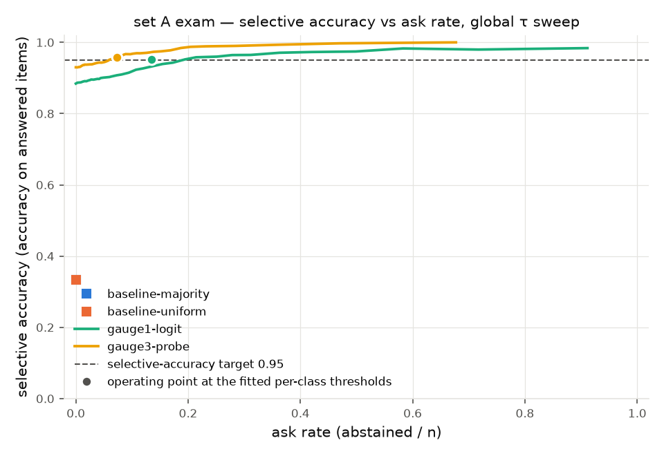

# nikasha

One sealed exam, many decision gauges. A gauge is any program that, for one item, returns a probability vector over the fixed label list (`no-call`, `one-call`, `multi-call`): one entry per label, every entry between zero and one inclusive, and the entries summing to one within a tolerance of one part in a million. Each gauge is its own process and writes `results/<gauge>.json`; the harness (`calibrate.py`, `score.py`, `readme.py`) reads that JSON and never imports an engine.

## Set A

set A: built from `gorilla-llm/Berkeley-Function-Calling-Leaderboard` (license Apache-2.0). Three labels, in fixed order:

- `no-call` — irrelevance files have no possible_answer ground truth; every item is labelled by category
- `one-call` — len(possible_answer ground_truth) == 1 (joined on id); items with count != 1 are dropped
- `multi-call` — len(possible_answer ground_truth) >= 2 (joined on id); items with count < 2 are dropped

| | total | no-call | one-call | multi-call |
|---|---|---|---|---|
| set A | 1000 | 334 | 333 | 333 |
| fit | 300 | 100 | 100 | 100 |
| exam | 700 | 234 | 233 | 233 |

Dropped for a category contradiction: 0 items — ground-truth call count contradicts the file's category.  
Dropped for missing ground truth: 1 item (BFCL_v3_live_multiple.json: 1) — no possible_answer row for the item's id (or ground_truth not a list/dict).  
Sampling draws at least 10 items from every non-empty source file, so live and non-live items both appear. Seed 20261007 for sampling and split.

Canary (KU3): verbatim completions 0/20, twins 0/20 — not flagged; gauge ① is reported as a zero-shot read.

## Results

| gauge | n_exam | accuracy [CI] | ECE raw → cal | ask rate @ SA 0.95 [CI] | selective accuracy achieved [CI] | AUROC [CI] |
|---|---|---|---|---|---|---|
| uniform | 700 | 33.4 [30.1, 37.3] † | 0.001 → 0.001 † | 100.0 [100.0, 100.0] † | — | 0.500 [0.500, 0.500] † |
| majority-of-fit | 700 | 33.4 [30.1, 37.3] † | 0.666 → 0.666 | 100.0 [100.0, 100.0] † | — | 0.500 [0.500, 0.500] † |
| gauge ① logit read | 700 | 88.4 [85.9, 90.7] | 0.106 → 0.041 † | 13.4 [11.0, 16.0] | 95.2 [93.4, 96.9] | 0.836 [0.789, 0.881] |

† within noise: 95% CIs overlap with another row.

A constant uniform predictor is calibrated by construction (confidence 1/3, accuracy ≈ 1/3), so its ECE overlaps any well-calibrated gauge.

95% percentile bootstrap CIs, 1000 resamples, seed 20261007; ECE with 15 equal-width bins; selective-accuracy target 0.95; thresholds fitted on the fit split only.

Letter bias of gauge ① logit read (fit split, rotation r0 minus the mean over rotations, logits per label in label order): [+0.36, +0.79, −1.63]; averaging over three letter orders removes this bias.

Hidden-state check (KU2): last hidden state shape [1, 156, 3840], head reproduces logits within max-abs 0.0 — PASS.

## Engines and licenses

- gemma-4-12b-8bit-text: license: apache-2.0 — license_link: https://ai.google.dev/gemma/docs/gemma_4_license

## Promised, not claimed

promised, not claimed: gauge ③ probe, Jev column, embeddings gauge, set B, set C from the measured week

Generated by nikasha/readme.py from results/*.json and data/seta/manifest.json — no number in this file is written by hand.
